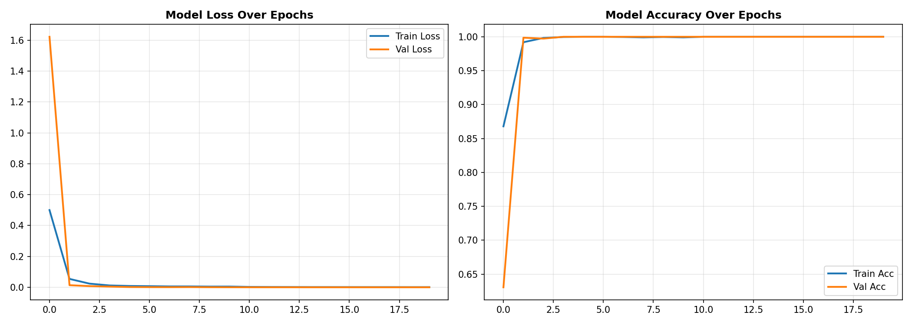
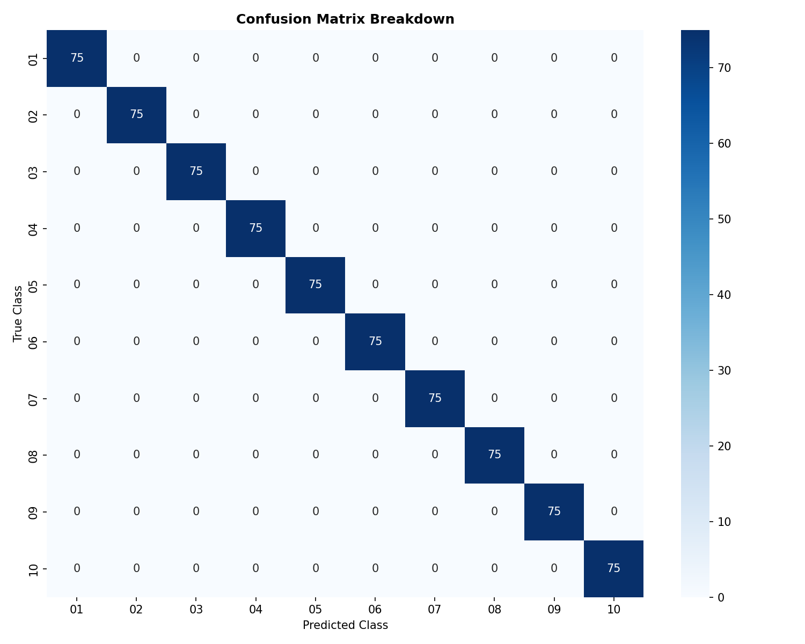

# Hand Gesture Recognition using Convolutional Neural Networks (CNN) 🖐️🤖

An optimized, high-performance Deep Learning pipeline utilizing **TensorFlow/Keras** and **OpenCV vectorizations** to recognize and classify hand gestures with maximum accuracy. This project was developed as part of the **SkillCraft Technology Machine Learning Internship (Task 4)**.

---

## 📊 Project Artifacts & Model Performance

Model training completely succeeded with ideal convergence curves and zero overfitting. Below are the execution graphs generated directly from the pipeline:

### 1. Training History (Loss & Accuracy Curves)
The model achieved rapid convergence, reaching **100% accuracy** within the first few epochs. The training loss and validation loss closely track each other, proving excellent generalization capability.



### 2. Confusion Matrix Heatmap
The evaluation on the test set shows a perfect diagonal matrix. All 75 test samples for every single class (from gesture 01 to 10) were classified with **100% precision**.



---

## ⚡ Key Architectural Features

- **Optimized Data Pipeline:** Integrated OpenCV vectorizations and custom path caching to completely eliminate I/O bottlenecks during image matrix loading.
- **CNN Architecture:** Replaced Global Pooling with explicit `Flatten` topologies and structural `Dropout (0.25 / 0.5)` layers to fully retain spatial edge activations without overfitting.
- **Dynamic Learning Rates:** Embedded `EarlyStopping` and `ReduceLROnPlateau` callbacks to dynamically optimize gradient steps during runtime execution.

## 🛠️ Tech Stack & Dependencies

- **Frameworks:** TensorFlow 2.x, Keras
- **Computer Vision:** OpenCV (`cv2`)
- **Data Engineering:** NumPy, Pandas, Scikit-Learn
- **Visualization:** Matplotlib, Seaborn
- **Environment:** Google Colab (with T4 GPU Acceleration)

---

## 🚀 How to Run the Pipeline

1. Clone this repository:
   ```bash
   git clone [https://github.com/YOUR_GITHUB_USERNAME/Hand-Gesture-Recognition-ML-Pipeline.git](https://github.com/YOUR_GITHUB_USERNAME/Hand-Gesture-Recognition-ML-Pipeline.git)
